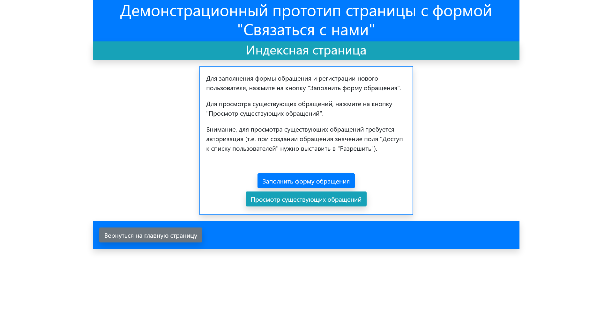
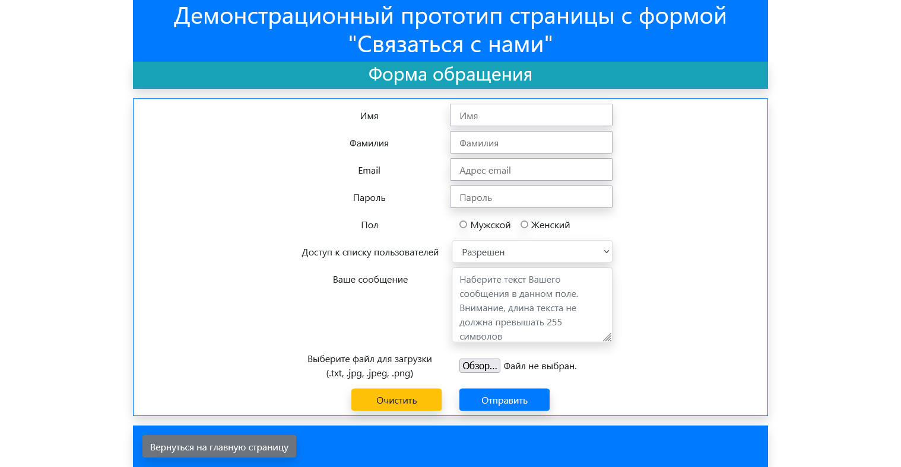
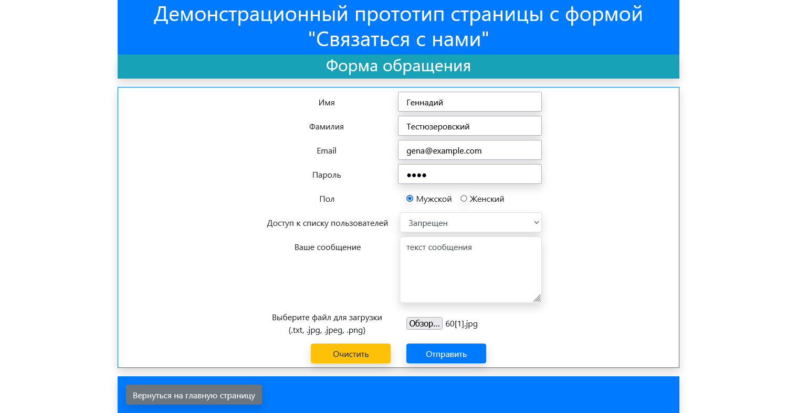
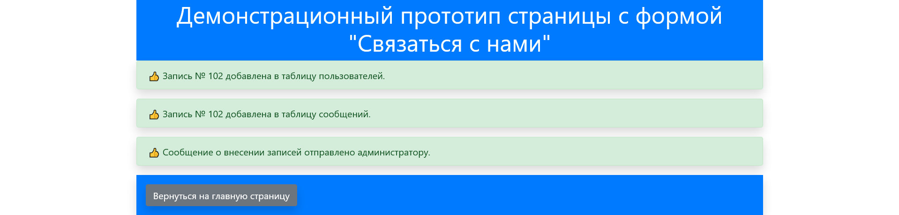
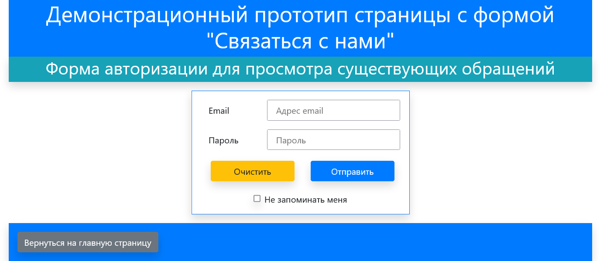
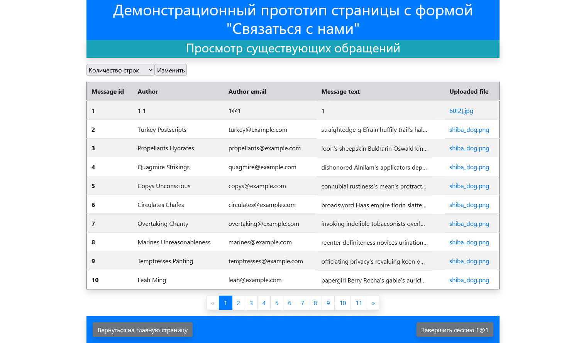

# Описание проекта

Проект создан в рамках выполнения практического задания "Базового модуля".

## Требования

Для проекта требуются:
1. Рабочее окружение "CS-Cart Development Environment" (https://github.com/cscart/development-docker):
    * при разработке использовались три сервиса из docker-compose.yml:
      * php7.4
      * mysql5.7
      * nginx
2. Сам проект, размещенный в директорию development-docker/app/www/
    * склонировать репозиторий проекта
      ```bash
      $ git clone https://github.com/atghru/php_practice.git development-docker/app/www/
      ```
    * или распаковать архив проекта в директорию development/app/www/

2. Права для пользователя и группы www-data (uid 33, gid 33) на директории "development-docker/app/log/sendmail", "development-docker/app/www/upload"
    * ```bash
      $ chown 33:33 путь/до/директории
      ```
      или

    * ```bash
      $ chmod 777 путь/до/директории
      ```
3. База данных mysql и реквизиты доступа к базе данных
    * Создание БД и пользователя
      ```sql
      CREATE DATABASE crudb CHARACTER SET utf8mb4 COLLATE utf8mb4_unicode_520_ci;
      CREATE USER 'crudboy'@'%' identified by 'crudpass';
      GRANT ALL PRIVILEGES ON crudb.* to 'crudboy'@'%';
      ```
    * Загрузка дампа БД
      ```shell
      $ docker exec -i mysql5.7 sh -c 'exec mysql crudb -ucrudboy -pcrudpass  --default-character-set=utf8mb4' < crudb_dump.sql
      ```
## Использование проекта

1. Проект доступен по адресу http://php7.4.localhost

2. На первой странице проекта отображается инструкция по работе с проектом


3. После нажатия на кнопку "Заполнить форму обращения" загружается страница Форма обращения



4. После заполнения формы и нажатия кнопки отправить, данные обрабатываются (создаются записи в таблице пользователей и таблице сообщений), и появляется сообщение об удачной обработке.


5. После нажатия на кнопку "Вернуться на главную страницу" загружается "Индексная страница".

6. Для просмотра сообщений необходимо нажать на кнопку "Просмотр существующих сообщений", после чего загрузится окно с вводом данных для авторизации. Если ранее не было создано пользователей с доступом к просмотру сообщений, можно использовать существующего пользователя "1" (Email: 1@1, Пароль: 1).

    * При успешной авторизации создается сессия пользователя, и последующая авторизация при нажатии на кнопку "Просмотр существующих сообщений" не потребуется.
    * Для завершения пользовательской сессии нужно нажать кнопку "Завершить сессию" в нижнем правом углу.
    * Внимание: при установке чекбокса "Не запоминать меня" в состояние "включено", пользовательская сессия будет завершена после вывода первой страницы с сообщениями.

7. После авторизации загрузится страница "Просмотр существующих сообщений" с таблицей. Для таблицы можно изменить количество выводимых строк, выбрав из выпадающего списка "Количество строк" необходимое число и применить это значение, нажав на кнопку "Изменить". Также для таблицы доступна постраничная навигация, для перехода на выбранную страницу с сообщениями.

    - "Message id" - номер сообщения
    - "Author" - автор
    - "Author email" - email адрес автора
    - "Message text" - часть текста сообщения
    - "Uploaded file" - файл из сообщения, доступный для скачивания при нажатии на ссылку
